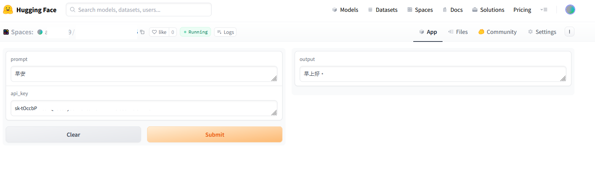
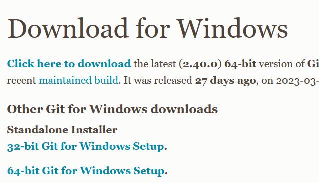
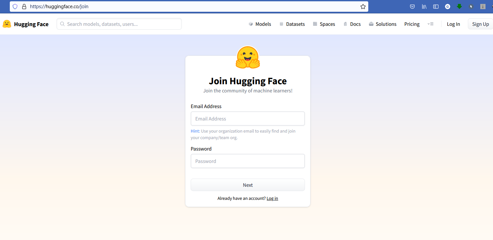
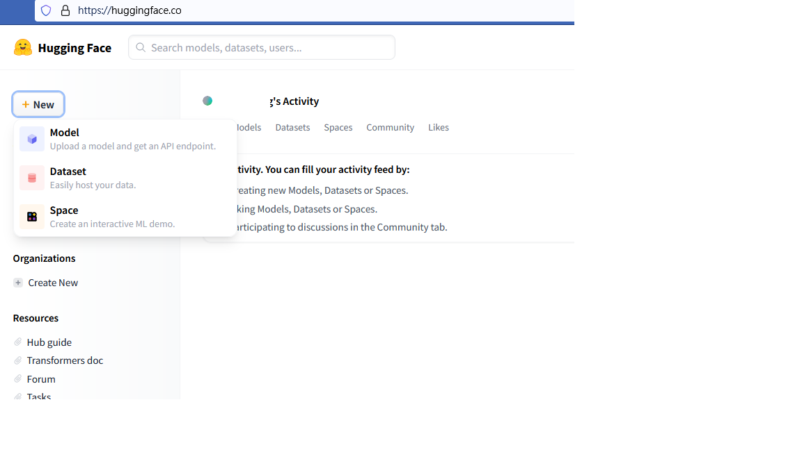
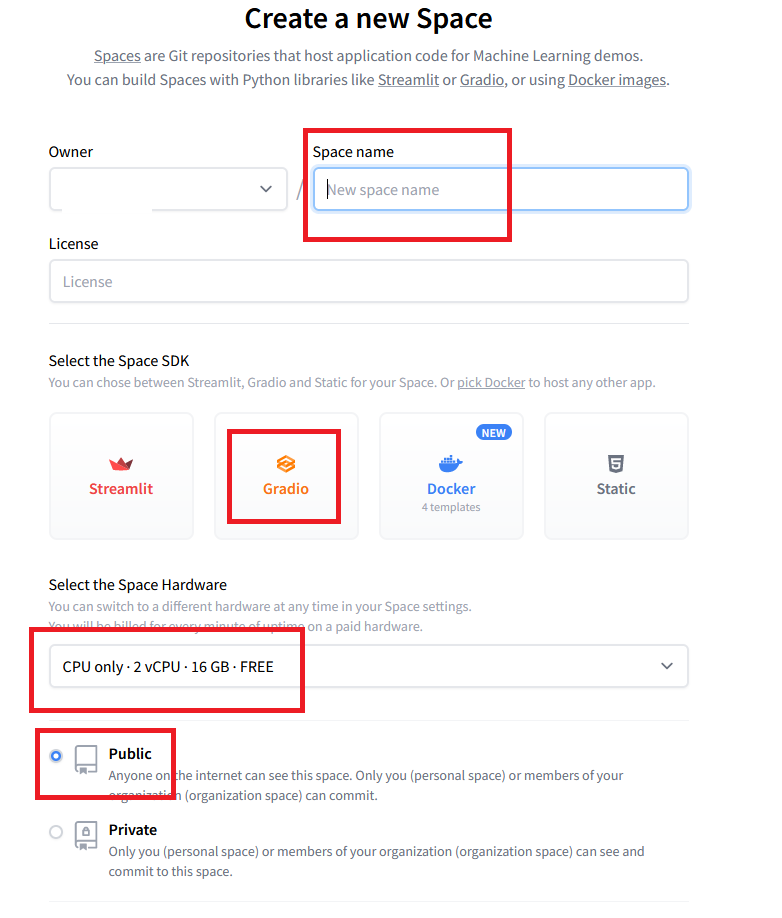

# Gradio-ChatGPT3.5-Spaces
# 一個使用Gradio框架和GPT3.5 turbo模型官方API，快速建置Web app於平台Hugging Face Spaces。

  

### 0. 安裝Git。下載64-bit版本。

https://git-scm.com/download/win

  

### 1. 本專案參考了以下官方的方案改成製作，只針對剛學習Python或Gradio的朋友來佈置Web app在Hugging Face Spaces上。

https://gradio.app/quickstart/#hello-world  
https://huggingface.co/docs/hub/spaces-config-reference

### 2. 到Hugging Face Spaces上註冊。

https://huggingface.co/join

  

### 3. 註冊完回到主畫面，選擇右上角+New -> Space。

  

### 4. 輸入專案名稱(Space name)，License不用管，SDK選擇Gradio，剩下的不用做更改，按下Create Space。

  

### 5. 輸入以下指令複製你的專案下來到本機。注意路徑。

    git clone https://huggingface.co/spaces/你的帳號名稱/你的專案名稱

### 6. 輸入以下指令複製我提供的專案下來到本機。注意路徑。

    git clone https://github.com/pyfbsdk59/Gradio-ChatGPT3.5-Spaces

### 7. 複製我的專案內的app.py和requirements.txt到你的專案內覆蓋過去。

### 8. 依序輸入以下指令（確定先裝好Git）（在你的專案資料夾內的路徑下操作）

    git add .

    git commit -m "first commit"

    git push

### 9. 輸入Hugging Face的帳號和密碼。等個幾秒就會完成，顯示網頁。

